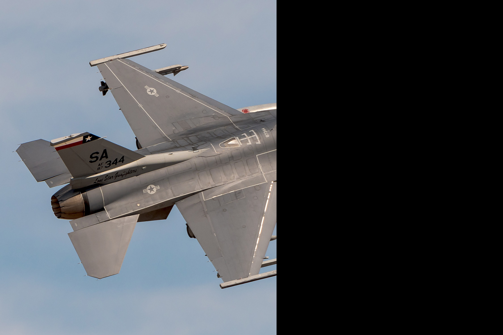
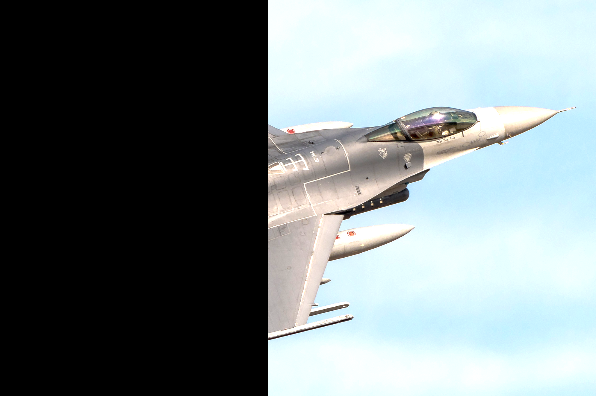
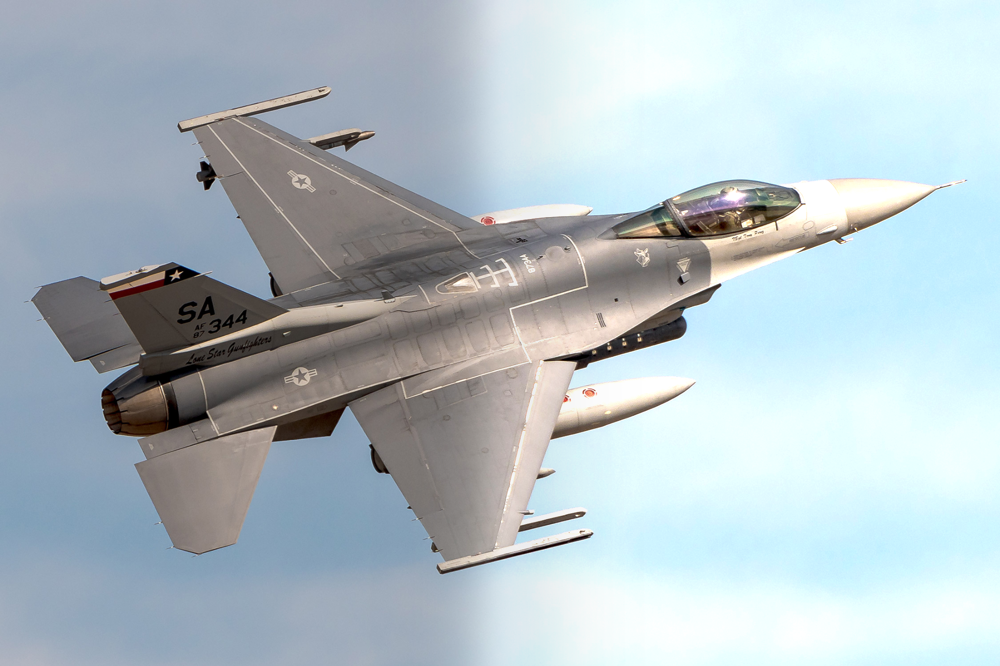

# CUDA Multiband Blender

This project demonstrates image stitching and blending using OpenCV with CUDA acceleration.  
The goal is to compare different blending methods to show tradeoffs in speed vs quality.
I will be implementing multiband blending from scratch, and comparing it with feathering or perhaps a simple gradient blend.  

I built this project as part of a technical interview demo.


### OpenCV Build Notes

This project uses a custom OpenCV build with CUDA support.  
Below are the exact versions and steps I used (Windows, RTX 3080):

**Dependencies downloaded:**
- OpenCV source code v4.9.0
- OpenCV contrib v4.9.0 (must match source version)
- CUDA Toolkit v12.3
- cuDNN v8.97
- CMake
- Visual Studio 2022 (with C++ options enabled)

**Setup:**
1. Copy cuDNN files into `C:/Program Files/NVIDIA GPU Computing Toolkit/CUDA/v12.3/`.
2. Create `C:/OpenCV_GPU/` with subfolders:
   - `build/`
   - `install/`
3. Move `opencv/` and `opencv_contrib/` into `C:/OpenCV_GPU/`.
4. Open CMake, set:
   - Source: `opencv-4.9.0/`
   - Destination: `build/`
   - Check “Grouped” option
   - Click *Configure*.

**Enable in CMake-GUI:**
- WITH_CUDA
- ENABLE_FAST_MATH
- BUILD_OPENCV_WORLD
- OPENCV_EXTRA_MODULES_PATH -> `opencv_contrib/modules`
- OPENCV_DNN_CUDA
- BUILD_OPENCV_DNN

**Then enable:**
- CUDA_FAST_MATH
- CUDA_ARCH_BIN = 8.6 (RTX 3080)
- CMAKE_INSTALL_DIRECTORY -> `install/`
- CMAKE_CONFIGURATION_TYPES = Release

**Generate & Build:**
    powershell:
    `C:\Programming Files\CMake\bin\cmake.exe" --build '../OpenCV_GPU/build' --target INSTALL --config Release`


### Environment Variables

Add the path to the dlls to your system path:
    `C:\...\OpenCV_GPU\installe\x64\vc17\bin`


### Visual Studio Setup

Now that our CUDA-enabled OpenCV is compiled, we need to point our development environment to it.
Right click your project and go to Properties. Add the following paths and variables:

C/C++ -> General -> Additional Include Directories:
    `C:\...\OpenCV_GPU\install\include`

Linker -> General -> Additional Include Directories:
    `C:\...\OpenCV_GPU\install\x64\vc17\lib`

Linker -> General -> Input:
    `opencv_img_hash490.lib`
    `opencv_world490.lib`

Set the project to `Release` and `x64`. Now, we can import CUDA-enabled OpenCV!
Use these in your program to verify OpenCV can find your gpu:
    `cv::cuda::getCudaEnabledDeviceCount();`
    `cv::cuda::DeviceInfo info(0);`


## Project Structure
```text
.
├── data/ # Input images (place your source images here. I used f16 pics with ~10% overlap in the middle)
│ ├── f16_left.png
│ └── f16_right.png
├── results/ # Output results (auto-created if not present)
│ ├── multiband_blend.png
│ ├── feather_blend.png
│ ├── mask.png
│ └── pyramids/ # Pyramid levels (Based on 'n' number of levels used when blending)
│   ├── gauss_n.png
│   ├── lap_n.png
│   └── gauss_mask_n.png
├── src/
│ ├── cuda-multiband-blender.cpp (contains main())
│ ├── MultibandBlender.cpp
│ ├── MultibandBlender.hpp
│ ├── masks.cpp
│ └── masks.hpp
└── README.md
```
## Inputs

Left and right image inputs, with their associated masks. Right image made brighter to show blending prowess. Masks are generated at runtime:

<p float="left">
  
   
</p>


<p float="left">
  
   
</p>


## Results

Custom CUDA multiband blend:



OpenCV Feather blend:


## References

This implementation is based on the classic paper:

- Burt, P. J., & Adelson, E. H. (1983). *A Multiresolution Spline with Application to Image Mosaics*.  
  ACM Transactions on Graphics, 2(4), 217–236.  
  [https://doi.org/10.1145/245.247](https://doi.org/10.1145/245.247)


